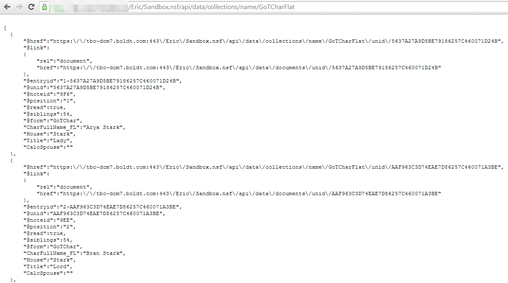

### TL;DR

Impatient and want to see the code? Jump down to [my Java class](#handling-the-data).

### What and Why?

Generating custom JSON data is, unless you're on a verison of Domino server previous to 8.5.3 UP1, _virtually_ unnecessary. Everything you see below can be fully replicated via the Domino Data/Access Services. The reason for that is the fact that I made use of a simple NotesView iteration pattern to generate and return the application/json data. The missing piece, the _whole reason why_, is on _your_ **application requirements**. When you need JSON formatted data in a custom format due to formatting preferences or application logic needs, and it can't just be in a View, that's when this comes into play. So if you start doing what I've done, ask yourself first, can it be just in a View?

If that's the case, make sure you've turned on Domino Data Services for your NSF and the View you need. If your use case is more specific, that's what follows.

### Custom JSON Data Generation

My approach here is super simple, at least as far as the XPages part goes. The only thing I'm using the XPage for is as an end point, in [XAgent fashion](https://www.wissel.net/blog/d6plinks/shwl-7mgfbn). Seriously, it's just a hook into the Java method, have a look:

https://gist.github.com/edm00se/ce4206cf3daff409b8f3#xaJsonFromJavaProvider.xsp.xml

Just invoke the fully qualified package.Class.Method() in the afterRenderResponse and you're ready to go.

### XAgent-ize Your Java Method

Note: I'm assuming you know what they are, what they do, and how to implement them.

Recommended: separate the JSON data build into a method separate from the handler for the XAgent, which does the grunt work of the FacesContext ineraction. I recommend this as you can then just pass the data without using an XAgent, for consumption via server-side (e.g.- extending into another class for bean or POJO use), as opposed to the client-side application logic I'm assuming. No matter how you slice it, you should know how you want to provide and consume your data.

As is the usual, we establish our handles on the FacesContext and give ourselves access to the ResponseWriter; the same as [any XAgent](https://openntf.org/XSnippets.nsf/snippet.xsp?id=xagent). This is how we'll be outputting data. In the ExternalContext response, we set the header information; e.g.- application/json as the content-type, no-cache so as to keep the data from becoming stale, and set the character encoding.

As my try/catch block begins, you'll note (if you're following along at home and building your Class off of mine) that there's an unused variable warning for the paramters. I left this in there so that no one else need repeat my efforts at discerning a good way of getting the URL query parameters; it took a little trial and error for me, as I hadn't seen it done at the time.

### The Good Stuff

I have one single external library/JAR dependency, my good friend [com.google.gson](https://code.google.com/p/google-gson/). I'm only using JsonObject and JsonArray in this example, as you can see from my imports. For the full example Java method, scroll down to the bottom.

So, here's the application logic portion. For my example, I iterate a View, grabbing two fields out of my _semi-improved fake names_, full name and title. The _semi-improved fake names_ is a collection of basic info of Game of Thrones characters from the first two books; technically making them Song of Ice and Fire characters (for you fellow Georege R.R. Martin fans). The original Fake Names Database is handy for prototyping against consistently formatted sample data and is available from [xpagescheatsheet.com](https://xpagescheatsheet.com/cheatsheet.nsf/home.xsp).

Creating a JsonObject with with the Google GSON library can be done a couple ways, in this example, you'll note I've opted to instantiate the object right away and populate the _error: true/false_ and _errorMessage: message_ properties at the end of the try or catch blocks, so as to always return a **valid application/json object**. As I'm iterating a number of objects with the same format of properties, I shove them into a JsonArray, which gets added under the property of _data_. This move makes it easy to segregate your client-side error-handling and/or valid response elements, all based on computed visibility of your data response of _error==true/false_.

The result gives us exactly what we're looking for.

### Pro Tip: Chrome DevTools

With the right tools, things get easier. Chrome's DevTools give a nice Preview tab to individual network requests. When it comes to json data, it lets us drill down nicely or switch over and view the raw response. Like this:

New to Chrome DevTools? Check out [this free primer course](https://discover-devtools.codeschool.com/) from codeschool.com.

### A Brief [AngularJS](https://angularjs.org/) Plug

In client-side JavaScript, you can programmatically determine whether to take one path or another, but with AngularJS, this gets much easier with [_ng-show_](https://docs.angularjs.org/api/ng/directive/ngShow) and [_ng-hide_](https://docs.angularjs.org/api/ng/directive/ngHide). For those used to computing the visibility property in XPages, similar to `<xp:div rendered="#{javascript:myVariable==true}">`, this is _mildly_ analagous; as such:
`
`.

### Handling the Data

[Update:]&nbsp;[as pointed out by paul t. calhoun](https://twitter.com/ptcalhoun/status/503993722556940288), a package available, if you're not looking to add the Google GSON jar, or any external library, you can implement [com.ibm.commons.util.io.json](https://public.dhe.ibm.com/software/dw/lotus/Domino-Designer/JavaDocs/DesignerAPIs/com/ibm/commons/util/io/json/package-summary.html). The largest difference I saw was the syntax. I'm sure someone more learned could tell me about the mechanics of the two packages. To view my Class with the IBM `com.ibm.commons.util.io.json` library implementation, check out [this gist here](https://gist.github.com/edm00se/e5626f63ef7573fd2f3e).

Here's my method, complete with slightly rambling, but hopefully insightful to a newbie, comments.

https://gist.github.com/edm00se/ce4206cf3daff409b8f3#DataProvider.java
