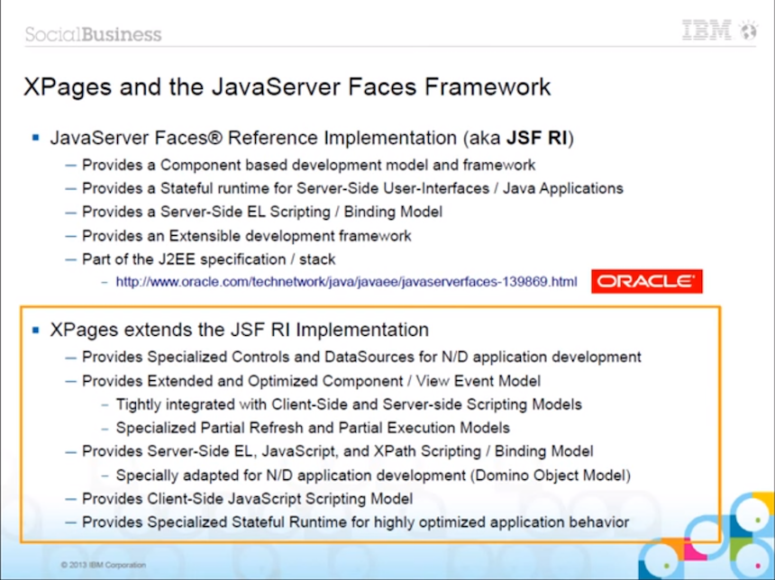

#### Intro

This is a quick post, covering something I overheard while at MWLUG and comes back to some application architectural principles which I have a bit of a passion for. Read on at your own peril 😉

[Update]

I added a bit from a tweet by Tony McGuckin about the XPages runtime's components.

[/Update]

### Back to the Grind After MWLUG

There's an intersting slump I experience after getting back from a conference. Not only do I get to clear out of the mountain of things that seem to crop up only while I'm out of the office, but it seems that I'm able to come away from such a gathering with other developers with lots of great ideas for both my growth as a developer but also for what I'm able to accomplish for my company and its users that it's a nearly unbearable amount to be able to extract from my own head, but I try. For this last week though, I just worked the tasks at hand.

#### A Funny Thing

While at MWLUG, I overheard someone make a reference to people "not liking POST" as an HTTP request. I'm fairly certain it may have been said in jest as [a blog post I wrote previously](/xpages/rest-is-best) talked about "classical" AJAX-y requests containing markup (specifically analagous to an XPages partial refresh event, which fires a dojo.xhrPost that returns the HTML content of the selected _refreshId_ and re-injects the content to the page). So here's a reminder to all, XPages gives us:

* an application runtime (JSF)
* a striped database (though for performance it's best to separate it)
* with a greatly convenient security model (that makes it _very_ easy to map roles and groups across applications)
* and a bunch of OoB (out of the box) controls that aid in [RAD](https://en.wikipedia.org/wiki/Rapid_application_development) and have some excellent hooks to automate a large number of functions ([ExtLib Relational controls](https://www-10.lotus.com/ldd/ddwiki.nsf/dx/Video__Using_the_Relational_Controls_in_the_Extension_Library), for instance)

[Update]

As Tony McGuckin pointed out on Twitter, there's more to the XPages runtime than just the JSF runtime components. Since it's a larger list than my couple of bullet points, I'll let the tweet and screen shot from the linked XPages Masterclass video do the talking.

##### The Tweet

https://twitter.com/tonymcguckin/status/638678645595336704

##### The Screen Shot

[/Update]

#### My Beef With Transporting Markup

My list above of what XPages provides us lists the controls that we most often associate as being "XPages" (specifically the design elements of XPages and Custom Controls, along with the _xp_ and _xe_ controls) at the end. My approach is opinionated in the absolute segregation of front-end and back-end, but it uses the application runtime provided by XPages (and its JSF implementation) to provide a great experience with excellent results. The OoB elements give us _one way_ of doing things, so since it bugs me, I'm going a different way, without issue.

**Transporting markup in our post-page load XHRs is inefficient**; regardless of whether we call them AJAX calls, partial refreshes, or whatever. That's my bottom line. I don't think POST as an HTTP method is inferior (they're just HTTP methods), but to add to a request's body content, just so we can get a small data update in the screen, when we could otherwise have our data providing the same response just in how we build our URI from a simple GET, the logic seems clear to me.

#### What to Do About It

As my demo application has been showing, I've been going the direction of a front-end heavy app (AngularJS app in the UI) with HTTP servlet RESTful API driven data access. This doesn't necesssarily need an XPages design element (root XPage and Custom Control) since it can/is served from the WebContent directory. For any still wondering, yes I do continue development on and maintain applications that aren't entirely "my way" when it comes to what are already in use. I've refactored core code when able (I've seen some scary SSJS libraries and vanquished as many beasts as I've been able to) because I firmly believe in keeping core business logic separate from UI logic.

That being said, my advice to any in a "normal" XPages context is **embrace the JSON-RPC** control and Java beans (managed or POJO). If your business logic is driven inside a controller class, it can just as easily be invoked from a bean or from a servlet (or from SSJS inside a JSON-RPC's method script). If Java isn't your thing (if you're still learning, and you should embrace your JEE stack), [the JSON-RPC control](https://www.notesin9.com/2014/05/21/tim-explains-json-rpc-codefortim/) lets you accomplish most of the same task of exposing server-side operations and logic, with minimal overhead, to the client-side (browser) for CSJS access; it's a win-win either way.

### In Case You Missed It...

[My last post, recapping my session at MWLUG](/self-promotion/mwlug-ad113-success/), managed to get missed in my first tweet of the link. I updated the previous post (announcing my session at MWLUG) with a link at the top, but some may have missed it. Please check it out, there's a link to [my slide deck](https://www.slideshare.net/edm00se/ad113-speed-up-your-applications-w-nginx-and-pagespeed), [GitHub repository](https://github.com/edm00se/AD113-Speed-Up-Your-Apps-with-Nginx-and-PageSpeed) with my configs, screen shots of my configs in use, and (you guessed it) my slide deck in PDF and PPTX formats.
